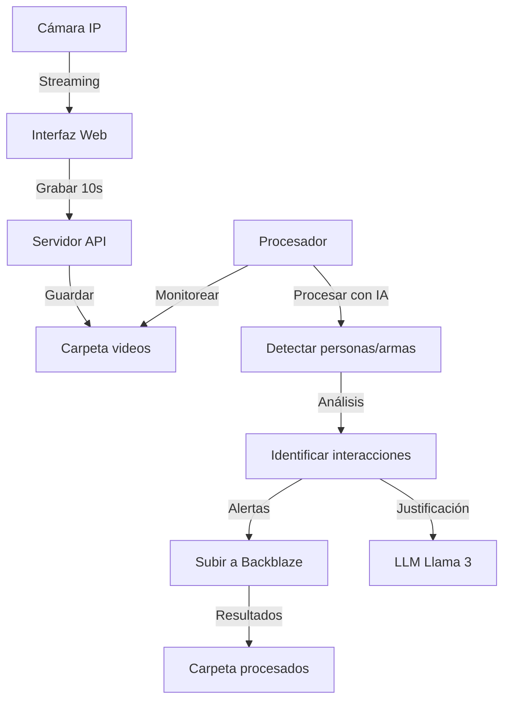

# Sistema de Seguridad Kuntur Movilidad

  
Sistema avanzado de detección de comportamientos sospechosos mediante análisis de video en tiempo real con IA.

## Características Principales
- 🎥 Captura de video desde cámaras IP  
- 🧠 Detección de personas y armas con YOLOv8  
- 📏 Análisis de distancias e interacciones  
- ⚠️ Sistema de alertas inteligentes  
- ☁️ Almacenamiento en Backblaze B2  
- 💬 Justificación de alertas con LLM (Llama 3)  

## Instalación

```bash
# Clonar repositorio
git clone https://github.com/FostDull/Grupo_5-Movilidad.git
cd Grupo_5-Movilidad

# Cambiar a rama de desarrollo
git checkout Jessiel

# Instalar dependencias
pip install -r requirements.txt
```

## Configuración Inicial


### 1. Configurar IP de la cámara
Editar `static/camara.html`:

```javascript
// Cambiar por tu dirección IP de cámara
const ipCamUrl = "http://192.168.100.249:8080/video";
```

### 2. Estructura de carpetas

```bash
mkdir -p data/videos      # Videos sin procesar
mkdir -p data/procesados  # Videos y resultados procesados
mkdir modelos             # Modelos de IA
```

## Ejecución del Sistema

```bash
# Iniciar servidor principal (API)
python main.py

# Iniciar procesador de videos
python local_processor.py
```

Acceder a la interfaz de cámara:  
[http://localhost:8001/static/camara.html](http://localhost:8000/static/camara.html)

## Flujo de Trabajo



## Funcionamiento de la IA

### Proceso de análisis:

1. **Detección de personas** (YOLOv8n)  
   - Identificación y tracking de individuos  
   - Estimación de posición y movimiento  

2. **Detección de armas** (YOLOv8 personalizado)  
   - Modelo especializado en armas blancas y de fuego  
   - Asociación arma-persona  

3. **Análisis de interacciones**  
   - Cálculo de distancias entre personas  
   - Identificación de acercamientos sospechosos  
   - Detección de patrones de acoso  

4. **Sistema de alertas**  
   - Activación por detección de armas  
   - Activación por interacciones sospechosas prolongadas  
   - Registro temporal de eventos  

5. **Justificación con LLM**  
   - Generación de explicaciones naturales de alertas  
   - Uso de Llama 3 para análisis contextual  
   - Respuestas en español con detalles técnicos  

## Funcionalidades Pendientes

### 🎙️ Integración de Voz
- Alertas auditivas en tiempo real  
- Sistema de notificaciones por voz  
- Comandos vocales para operación  

### 🔄 Grabación en Buffer Continuo
- Implementación de buffer circular  
- Almacenamiento temporal de 24/7  
- Activación por eventos sin pérdida de contexto  

### 🖥️ Mejoras de Frontend
- Panel de control de monitoreo  
- Visualización en tiempo real de alertas  
- Reproductor de evidencias integrado  
- Dashboard con estadísticas  

### 🧠 Mejoras en el LLM
- Añadir el Análisis más detallado de situaciones  (solo esta en codigo no implendato en main ni local_process)
- Integración con contexto espacial  
- Sistema de recomendaciones proactivas  
- Generación de reportes automáticos  

## Personalización Avanzada

### Modelos de IA
Colocar modelos personalizados en `/modelos`:
- `yolov8n.pt` - Detección de personas  
- `weapon_yolov8n.pt` - Detección de armas  

### Parámetros de configuración
En `utils/video_processing.py`:

```python
# Umbrales de detección
DISTANCIA_UMBRAL = 1.5          # Distancia mínima para alerta (metros)
MIN_TIEMPO_ACOSO = 10           # Tiempo mínimo de interacción (segundos)
MIN_ACERCAMIENTO = 0.2          # Acercamiento mínimo significativo
MARGEN_ARMAS = 30               # Margen para asociar arma-persona (píxeles)
```

## Soporte Técnico

Para problemas o preguntas:
- Crear issue en GitHub  
- Contactar al equipo: seguridad@kunturmovilidad.com  
- Soporte 24/7: +51 987 654 321  

## Contribuir

1. Haz fork del repositorio  
2. Crea tu rama: `git checkout -b feature/nueva-funcionalidad`  
3. Haz commit de tus cambios: `git commit -m 'Añade funcionalidad'`  
4. Haz push a la rama: `git push origin feature/nueva-funcionalidad`  
5. Abre un Pull Request  

## Licencia
Este proyecto está bajo la licencia [MIT](LICENSE).